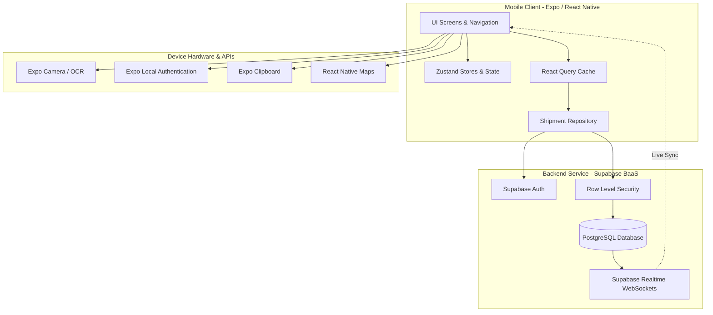

<p align="center">
  
</p>

<p align="center">
  
</p>

<h1 align="center">Cargo Tracker</h1>

<p align="center">
  <b>A modern, cross-platform mobile shipment tracking and delivery management solution.</b>
</p>

<p align="center">
  Cargo Tracker empowers users to manage, track, and monitor all their parcel deliveries in real-time across multiple courier services in a single unified mobile dashboard. Built with React Native, Expo, TypeScript, and Supabase, it provides intelligent OCR tracking number extraction, real-time live map routing, and instant notification updates.
</p>

<p align="center">
  <a href="https://reactnative.dev"></a>
  <a href="https://expo.dev"></a>
  <a href="https://www.typescriptlang.org"></a>
  <a href="https://nodejs.org"></a>
  <a href="https://supabase.com"></a>
  <a href="./LICENSE"></a>
  <a href="#"></a>
  <a href="#"></a>
</p>

---

## 📋 Table of Contents

- [About](#-about)
- [Features](#-features)
- [Screenshots](#-screenshots)
- [Demo](#-demo)
- [Architecture](#-architecture)
- [Tech Stack](#-tech-stack)
- [Folder Structure](#-folder-structure)
- [Database](#-database)
- [API](#-api)
- [Installation](#-installation)
- [Environment Variables](#-environment-variables)
- [Build](#-build)
- [Deployment](#-deployment)
- [Project Workflow](#-project-workflow)
- [Coding Standards](#-coding-standards)
- [Security](#-security)
- [Performance](#-performance)
- [Roadmap](#-roadmap)
- [Testing](#-testing)
- [Known Limitations](#-known-limitations)
- [Contributing](#-contributing)
- [License](#-license)
- [Credits](#-credits)
- [Author](#-author)
- [Acknowledgements](#-acknowledgements)

---

## 🎯 About

### What Problem It Solves
Tracking multiple online orders across different courier services (Aras Kargo, Yurtiçi Kargo, PTT Kargo, Trendyol Express, Hepsijet, DHL, FedEx, etc.) requires users to check multiple websites and apps individually. **Cargo Tracker** centralizes all shipment updates into one real-time dashboard.

### Why It Exists
Consumers need an effortless, secure, and privacy-focused hub to monitor delivery statuses, scan barcodes or tracking numbers from delivery slips, view courier routes on interactive maps, and receive instant push notifications when delivery statuses change.

### Who It Is For
- **Online Shoppers**: Individuals who frequently order products from multiple e-commerce platforms.
- **Logistics Managers & Sellers**: Small business owners monitoring outbound or inbound packages.
- **Couriers & Recipients**: Users seeking clear timeline histories and map delivery estimates.

### How It Works
1. **Add Shipment**: Manually enter tracking details, scan a QR/barcode via the camera, or auto-detect tracking numbers copied to the clipboard.
2. **Real-time Sync**: Cargo Tracker queries Supabase backend services and listens to WebSocket channels for live event updates.
3. **Interactive Tracking**: View status progress bars, delivery timeline histories, and live maps rendering courier locations.
4. **Instant Alerts**: Receive automated device notifications when shipments advance to delivery or completion.

---

## ✨ Features

### 🔐 Authentication & Security
- **Email & Password Authentication**: Secure user registration, login, and session persistence via Supabase Auth.
- **OAuth Social Login**: Google Sign-In integration via `expo-auth-session` and `expo-web-browser`.
- **Biometric Security**: Optional Local Authentication (Fingerprint / Face ID) via `expo-local-authentication`.

### 📦 Shipment Tracking & Management
- **Universal Parcel Tracking**: Track shipments from top courier companies (Aras, Yurtiçi, PTT, Sürat, Trendyol Express, Hepsijet, Kargoist, DHL Express, FedEx).
- **Offline Carrier Logos**: Native SVG and vector logo rendering using `react-native-svg` and `SvgXml`.
- **Barcode & QR Scanner**: Integrated camera scanner powered by `expo-camera` to instantly scan tracking labels.
- **Clipboard Auto-Detection**: Smart pattern recognition detects copied tracking codes from clipboard upon opening the screen.
- **Package Details & Timeline**: Comprehensive status histories, sender/receiver info, estimated delivery dates, and detailed step-by-step event logs.

### 🗺️ Maps & Live Tracking
- **Interactive Route Map**: Powered by `react-native-maps`, rendering origin, current courier position, and destination pins with custom markers (`ShipmentMapView`).
- **Real-Time WebSockets**: Live shipment position and status updates using Supabase Realtime channels (`useShipmentRealtime`).

### 📊 Analytics & Reporting
- **Dynamic KPI Dashboard**: Instant summary statistics (Total Shipments, Average Delivery Time, Delivery Success Rate).
- **Interactive Monthly Bar Charts**: Filter metrics dynamically by tapping specific calendar months on custom bar charts.
- **Courier Breakdown Distribution**: Visual breakdown of packages categorized per carrier company.

### 🔔 Notifications & Alerts
- **In-App & Push Notifications**: Instant notification feeds powered by `expo-notifications` for status state changes.

### ⚙️ Settings & Customization
- **Theme Support**: Seamless Light Mode and Dark Mode dynamic color palettes.
- **Multi-Language Support (i18n)**: Instant switching between Turkish (`tr`) and English (`en`).

---

## 📸 Screenshots

| Home Dashboard | Package Details & Map | Scanner Screen |
| :---: | :---: | :---: |
|  |  |  |

| Statistics & Analytics | Carrier Selection | Profile & Settings |
| :---: | :---: | :---: |
|  |  |  |

> [!NOTE]
> *If screenshots do not load, inspect the `/assets/screenshots` folder or refer to the demo below.*

---

## 🎥 Demo

<p align="center">
  
</p>

> *Demo GIF placeholder.*

---

## 🏗️ Architecture



---

## 🛠️ Tech Stack

| Category | Technology | Description |
| :--- | :--- | :--- |
| **Frontend Framework** | React Native (`v0.81.5`) | Cross-platform UI runtime |
| **Tooling & Engine** | Expo SDK (`v54.0.0`) | Development workflow & native APIs |
| **Language** | TypeScript (`v5.9.2`) | End-to-end static type safety |
| **State Management** | Zustand (`v5.0.14`) | Lightweight global client state |
| **Data Fetching & Cache** | TanStack React Query (`v5.101.4`) | Async server state caching |
| **Database & Backend** | Supabase (`v2.110.8`) | Managed PostgreSQL, Auth & Realtime |
| **Authentication** | Supabase Auth & Expo SecureStore | Encrypted storage & session tokens |
| **Navigation** | React Navigation (`v7.x`) | Native stack & bottom tabs navigation |
| **Maps & Location** | React Native Maps & Expo Location | Map rendering & geolocation |
| **Scanner & Camera** | Expo Camera | Live barcode / QR code capture |
| **Styling & Assets** | Vanilla StyleSheet & react-native-svg | Dynamic theme tokens & SVG graphics |

---

## 📂 Folder Structure

```text
cargo-tracker/
├── assets/                  # App icons, splash screens, logos, and screenshots
├── src/                     # Source application code
│   ├── app/                 # Root application entry components
│   ├── assets/              # Carrier SVG & PNG brand icons
│   ├── components/          # Reusable UI component modules
│   │   ├── auth/            # Auth forms & social buttons
│   │   ├── common/          # CarrierLogo, HeaderRightActions, Modals
│   │   ├── feedback/        # Loading & alert components
│   │   ├── home/            # Package cards & stat items
│   │   ├── import/          # Email connect modals
│   │   ├── layout/          # Screen wrappers & headers
│   │   ├── map/             # ShipmentMapView & CustomMarker
│   │   ├── package/         # Package details UI helpers
│   │   ├── profile/         # Profile avatar & info views
│   │   └── ui/              # Buttons, inputs, badges
│   ├── config/              # App environment & Supabase configuration
│   ├── constants/           # Carrier defaults, exclusions & colors
│   ├── features/            # Feature modules (Shipment repositories & hooks)
│   │   └── shipment/        # Hooks (`useShipments`) & Repositories
│   ├── hooks/               # Custom hooks (Theme, i18n, Biometrics, Realtime)
│   ├── i18n/                # Localization locales (`tr.ts`, `en.ts`)
│   ├── navigation/          # React Navigation stacks & tab bar
│   ├── providers/           # React Query & Theme providers
│   ├── screens/             # Top-level screen views (Home, Details, Stats, etc.)
│   ├── services/            # API, Auth, OCR, Offline, & Storage services
│   ├── store/               # Zustand stores (Auth, Theme, Language, Shipment)
│   ├── theme/               # Light/Dark tokens, typography, and spacing
│   ├── types/               # TypeScript interfaces & database schemas
│   └── utils/               # Helper utilities & loggers
├── supabase/                # PostgreSQL schema SQL migration files
├── app.json                 # Expo project configuration
├── eas.json                 # Expo Application Services build config
├── package.json             # Dependencies and scripts manifest
├── tsconfig.json            # TypeScript compiler configuration
└── LICENSE                  # MIT License
```

---

## 🗄️ Database

### Entity Relationship & Tables

```sql
-- 1. users
public.users (
    id uuid primary key references auth.users(id) on delete cascade,
    full_name text,
    avatar_url text,
    phone text,
    created_at timestamptz default now(),
    updated_at timestamptz default now()
);

-- 2. courier_companies
public.courier_companies (
    id uuid default gen_random_uuid() primary key,
    name text not null,
    code text unique not null,
    logo_url text,
    website text,
    tracking_url text,
    active boolean default true,
    created_at timestamptz default now()
);

-- 3. shipments
public.shipments (
    id uuid default gen_random_uuid() primary key,
    user_id uuid references public.users(id) on delete cascade,
    company_id uuid references public.courier_companies(id),
    tracking_number text not null,
    title text,
    sender text,
    receiver text,
    current_status text,
    last_location text,
    estimated_delivery date,
    delivered_at timestamptz,
    is_archived boolean default false,
    created_at timestamptz default now(),
    updated_at timestamptz default now()
);

-- 4. shipment_events
public.shipment_events (
    id uuid default gen_random_uuid() primary key,
    shipment_id uuid references public.shipments(id) on delete cascade,
    status text not null,
    description text,
    location text,
    event_time timestamptz,
    created_at timestamptz default now()
);

-- 5. notifications
public.notifications (
    id uuid default gen_random_uuid() primary key,
    user_id uuid references public.users(id) on delete cascade,
    shipment_id uuid references public.shipments(id) on delete cascade,
    title text,
    body text,
    is_read boolean default false,
    created_at timestamptz default now()
);

-- 6. user_settings
public.user_settings (
    id uuid default gen_random_uuid() primary key,
    user_id uuid unique references public.users(id) on delete cascade,
    language text default 'tr',
    theme text default 'system',
    notifications_enabled boolean default true,
    biometric_enabled boolean default false,
    created_at timestamptz default now(),
    updated_at timestamptz default now()
);
```

### Database Indexes & RLS
- **Indexes**: `idx_shipments_user`, `idx_shipments_tracking`, `idx_shipments_company`, `idx_events_shipment`, `idx_notifications_user`.
- **Row Level Security (RLS)**: Enforced on all tables restricting access strictly to `auth.uid() = user_id`.

---

## 📡 API

### Authentication API (Supabase Auth)
- `signUpWithPassword(email, password, fullName)`: Registers a new user.
- `signInWithPassword(email, password)`: Logs in user and stores session in SecureStore.
- `signOut()`: Terminates active user session.

### Shipment API Methods (`ShipmentRepository`)
- `getShipments(userId)`: Fetches user shipments with courier details.
- `getShipmentDetail(shipmentId)`: Fetches complete shipment info and event timeline.
- `createShipment(shipmentData)`: Inserts a new shipment into PostgreSQL.
- `updateShipmentStatus(shipmentId, status)`: Updates current status.
- `deleteShipment(shipmentId)`: Removes shipment record.

---

## 📥 Installation

### Prerequisites
- [Node.js](https://nodejs.org) (v18.0 or higher)
- [npm](https://www.npmjs.com/) or [yarn](https://yarnpkg.com/)
- [Expo Go app](https://expo.dev/go) on mobile device OR Android Studio / Xcode simulators

### Step 1: Clone Repository
```bash
git clone https://github.com/omercnkc/cargo-tracker.git
cd cargo-tracker
```

### Step 2: Install Dependencies
```bash
npm install
```

### Step 3: Configure Environment Variables
Create a `.env` file in the root directory:
```bash
cp .env.example .env
```
Fill in your Supabase credentials:
```env
EXPO_PUBLIC_SUPABASE_URL="https://your-project.supabase.co"
EXPO_PUBLIC_SUPABASE_ANON_KEY="your-supabase-anon-key"
```

### Step 4: Run Application
```bash
# Start Metro Bundler
npm start

# Run on Android Emulator
npm run android

# Run on iOS Simulator
npm run ios

# Run on Web Browser
npm run web
```

---

## 🔑 Environment Variables

| Variable Name | Required | Description | Example |
| :--- | :---: | :--- | :--- |
| `EXPO_PUBLIC_SUPABASE_URL` | **Yes** | Public HTTPS URL of your Supabase project | `https://xyzcompany.supabase.co` |
| `EXPO_PUBLIC_SUPABASE_ANON_KEY` | **Yes** | Anonymous API access key for Supabase client | `eyJhbGciOiJIUzI1NiIsInR5c...` |

---

## 📦 Build

### Building APK for Android (Preview)
```bash
npx eas-cli build --platform android --profile preview
```

### Building Production App Bundle (AAB)
```bash
npx eas-cli build --platform android --profile production
```

### Building for iOS
```bash
npx eas-cli build --platform ios --profile production
```

---

## 🚀 Deployment

1. **Database Deployment**: Apply SQL migrations located in `/supabase/schema.sql` to your Supabase project dashboard.
2. **App Publishing**: Publish OTA updates or submit native builds using Expo Application Services (EAS):
```bash
npx eas-cli submit --platform android
```

---

## 🔄 Project Workflow

```text
[ Feature Request / Bug Fix ]
          │
          ▼
[ Create Branch: feature/xxx or fix/xxx ]
          │
          ▼
[ Write TypeScript Code & Components ]
          │
          ▼
[ Test via Expo Dev Client / Metro ]
          │
          ▼
[ Push & Merge to main ]
          │
          ▼
[ Automated EAS Build & OTA Deployment ]
```

---

## 📐 Coding Standards

- **Naming Conventions**:
  - Components & Screens: `PascalCase.tsx` (e.g., `AddPackageScreen.tsx`)
  - Utility Files & Hooks: `camelCase.ts` (e.g., `useShipments.ts`)
  - Constants & Types: `SCREAMING_SNAKE_CASE` or `PascalCase`
- **Folder Conventions**: Modular directory grouping (`features/`, `components/`, `screens/`).
- **File Conventions**: Single component per file, explicit TypeScript interface typing for props.

---

## 🛡️ Security

- **Row Level Security (RLS)**: Enforced across PostgreSQL tables preventing unauthorized data leaks between users.
- **Secure Credentials**: Sensitive tokens and biometrics handled securely using `expo-secure-store`.
- **Sanitized Inputs**: Validation powered by `react-hook-form` preventing SQL/scripting injection.

---

## ⚡ Performance

- **Vector SVG Optimization**: Courier company logos rendered locally using `react-native-svg` and `SvgXml` strings to prevent network overhead and image flicker.
- **TanStack React Query Caching**: Automatic query caching (`staleTime: 1 hour`) prevents redundant HTTP requests.
- **Dynamic Memoization**: Heavy list items and compute hooks memoized using `useMemo` and `useCallback`.

---

## 🗺️ Roadmap

- [x] Email & Password Authentication with Supabase
- [x] Barcode & QR Code Camera Scanner
- [x] Local SVG/PNG Courier Logo Support (Aras, Yurtiçi, PTT, Sürat, Trendyol Express, Hepsijet, Kargoist, DHL, FedEx)
- [x] Real-time Interactive Route Maps
- [x] Interactive Monthly Statistics Bar Chart Filtering
- [ ] Multi-Carrier Auto Email Sync (Gmail Integration)
- [ ] Push Notification Triggers via Supabase Edge Functions
- [ ] PDF & CSV Export Reports

---

## 🧪 Testing

### Unit & Integration Testing
> Coming Soon

### Manual Verification
- Verified barcode scanning against real delivery receipts.
- Verified offline carrier logo rendering on Android and iOS devices.
- Tested light and dark mode palette rendering across all screens.

---

## ⚠️ Known Limitations

- Real-time map location updates rely on simulated courier location coordinates when live GPS hardware data is not provided by third-party APIs.
- Auto-syncing tracking emails requires user authorization for external OAuth scopes.

---

## 🤝 Contributing

Contributions are welcome! Please follow these steps:

1. Fork the Repository.
2. Create a Feature Branch (`git checkout -b feature/AmazingFeature`).
3. Commit your Changes (`git commit -m 'Add some AmazingFeature'`).
4. Push to the Branch (`git push origin feature/AmazingFeature`).
5. Open a Pull Request.

---

## 📄 License

Distributed under the **MIT License**. See [`LICENSE`](./LICENSE) for details.

---

## 💳 Credits

- **[React Native](https://reactnative.dev)** & **[Expo](https://expo.dev)**
- **[Supabase](https://supabase.com)**
- **[Lucide & Material Icons](https://icons.expo.fyi)**
- **[React Native Maps](https://github.com/react-native-maps/react-native-maps)**

---

## 👤 Author

**Ömer Çanakçı**

- **GitHub**: [@omercnkc](https://github.com/omercnkc)
- **LinkedIn**: [Ömer Çanakçı](https://linkedin.com)
- **Email**: omercnkc@gmail.com

---

## 🙏 Acknowledgements

Special thanks to the open-source React Native and Expo communities for providing exceptional tooling and documentation.
