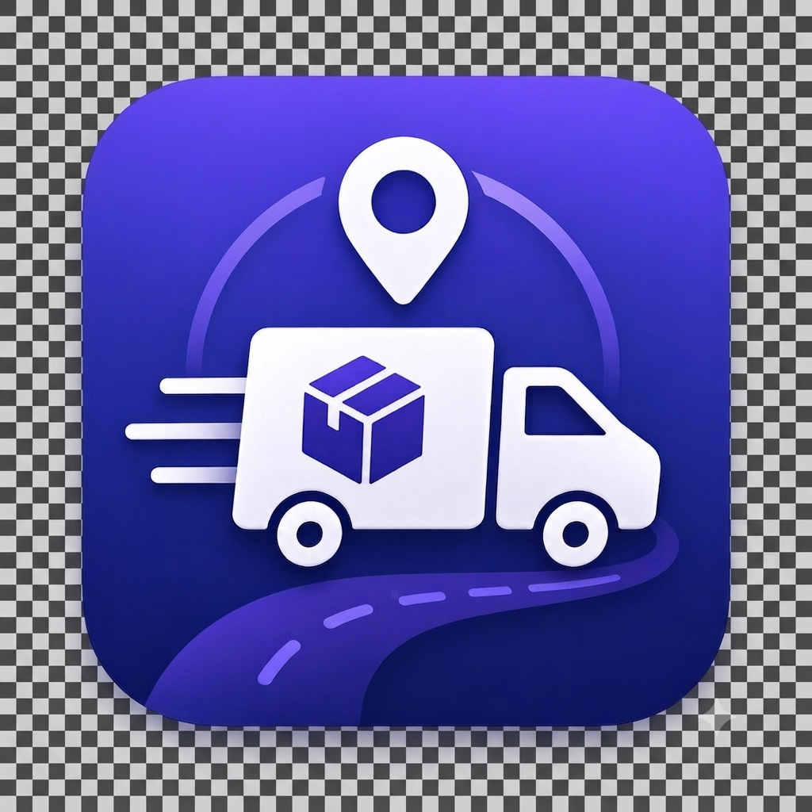
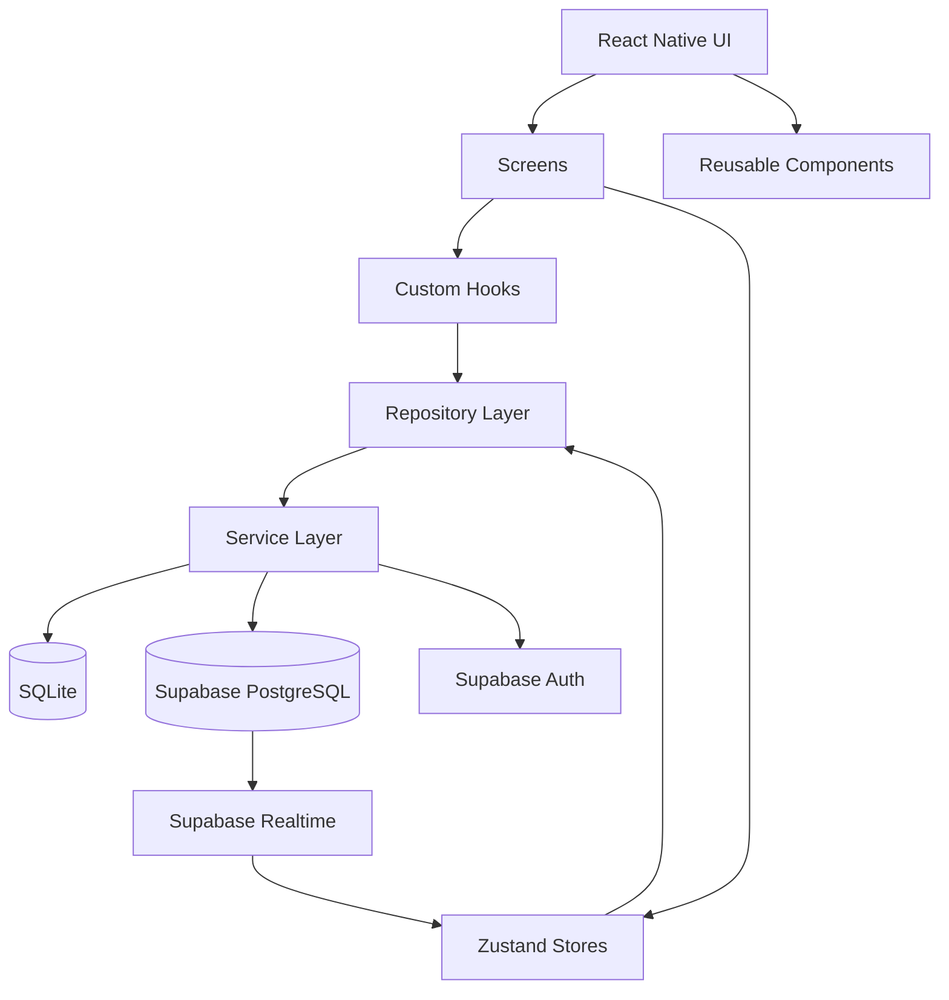

<p align="center">
  
</p>

<h1 align="center">Cargo Tracker</h1>

<p align="center">
  <strong>Modern, offline-first, cross-platform shipment tracking application.</strong>
</p>

<p align="center">
  Track, organize and monitor shipments from multiple courier companies
  through a single mobile experience.
</p>

<p align="center">


</p>

---

## Table of Contents

* [Overview](#overview)
* [Core Principles](#core-principles)
* [Features](#features)
* [Offline-First Architecture](#offline-first-architecture)
* [Application Architecture](#application-architecture)
* [Technology Stack](#technology-stack)
* [Project Structure](#project-structure)
* [Data Architecture](#data-architecture)
* [Synchronization Model](#synchronization-model)
* [Authentication & Security](#authentication--security)
* [User Experience](#user-experience)
* [Localization](#localization)
* [Testing](#testing)
* [Performance](#performance)
* [Development](#development)
* [Environment Configuration](#environment-configuration)
* [Build & Deployment](#build--deployment)
* [Development Workflow](#development-workflow)
* [Current Status](#current-status)
* [Known Limitations](#known-limitations)
* [Contributing](#contributing)
* [License](#license)

---

# Overview

**Cargo Tracker** is a cross-platform mobile shipment tracking application designed to bring shipments from multiple courier companies into a single unified experience.

Instead of requiring users to visit different courier websites and applications, Cargo Tracker provides a centralized environment for:

* Adding shipments
* Tracking shipment status
* Viewing shipment timelines
* Managing courier information
* Searching and filtering packages
* Viewing shipment locations on maps
* Scanning tracking labels
* Receiving notifications
* Managing delivery addresses
* Viewing shipment statistics
* Working without an internet connection
* Synchronizing local changes with the backend when connectivity returns

The application is built around an **offline-first architecture**, meaning the local device is not treated merely as a cache.

Local persistence is an integral part of the application data flow.

---

# Core Principles

Cargo Tracker is designed around several architectural principles.

### Offline First

The application should remain useful when connectivity is unavailable.

Local SQLite storage is used as the persistent offline data layer, while synchronization with Supabase occurs when connectivity becomes available.

### Local-First User Experience

User interactions should not unnecessarily wait for a remote request.

The application uses local state, persistence, optimistic UI and synchronization mechanisms to minimize perceived latency.

### Repository-Based Data Access

Screens should not directly depend on Supabase or SQLite implementation details.

Data access is abstracted through repository and service layers.

### Separation of Concerns

The codebase separates:

* UI
* Feature logic
* State management
* Persistence
* Synchronization
* Networking
* Authentication
* Localization
* Theme management
* Validation
* Utility functions

### Secure by Default

Authentication tokens, user data and database access are handled with security boundaries appropriate for a mobile application.

---

# Features

## Authentication

* [x] Email/password authentication
* [x] Supabase Auth integration
* [x] Persistent authentication session
* [x] Google OAuth authentication
* [x] Profile synchronization
* [x] Secure session storage
* [x] Biometric authentication support
* [x] Password recovery flow

---

## Shipment Management

* [x] Add shipment manually
* [x] Select courier company
* [x] Shipment detail screen
* [x] Shipment timeline
* [x] Shipment status tracking
* [x] Sender information
* [x] Receiver information
* [x] Delivery address management
* [x] Shipment search
* [x] Shipment filtering
* [x] Shipment pagination
* [x] All-packages bottom sheet
* [x] Shipment archiving
* [x] Courier-specific tracking data

---

## Courier Support

The application contains built-in support for multiple courier companies, including:

* Aras Kargo
* Yurtiçi Kargo
* PTT Kargo
* Sürat Kargo
* Trendyol Express
* Hepsijet
* Kargoist
* DHL Express
* FedEx

Courier branding is stored locally where possible to reduce unnecessary network requests and improve offline rendering.

---

## Barcode & QR Scanning

* [x] Camera-based barcode scanning
* [x] QR code scanning
* [x] Tracking number extraction from scanned labels
* [x] Camera permission handling
* [x] Tracking number validation
* [x] Clipboard-based tracking number detection

---

## Maps & Location

* [x] Interactive shipment map
* [x] Origin location
* [x] Destination location
* [x] Shipment location markers
* [x] Receiver-specific destination coordinates
* [x] Reverse geocoding
* [x] Graceful offline reverse-geocoding fallback
* [x] Courier route visualization
* [x] Shipment location isolation

---

## Statistics & Analytics

* [x] Total shipment statistics
* [x] Delivery success statistics
* [x] Average delivery duration
* [x] Monthly statistics
* [x] Courier distribution
* [x] Interactive statistics UI
* [x] Localized statistics labels
* [x] Dynamic analytics calculations

---

## Notifications

* [x] Notification infrastructure
* [x] In-app notification support
* [x] Shipment-related notification model
* [ ] Complete production-grade remote notification pipeline
* [ ] Advanced notification preferences

---

# Offline-First Architecture

One of the most important architectural characteristics of Cargo Tracker is its offline-first infrastructure.

The offline system was developed incrementally through multiple dedicated implementation stages.

## Offline Architecture Evolution

```text
V6.0
SQLite Storage
    │
    ▼
V6.1
Modular Offline Architecture
    │
    ▼
V6.2
Single-Flight Lock + Sync Engine
    │
    ▼
V6.3
Repository Integration + Rehydration
    │
    ▼
V6.4
Local POD Media Storage
    │
    ▼
V6.5
Optimistic UI + Offline UI Components
    │
    ▼
V6.6
Migration + Legacy Cleanup + E2E Validation
```

---

## Local Persistence

Cargo Tracker uses `expo-sqlite` as its primary offline database.

The local database includes:

* Shipment data
* Mutation queue
* Synchronization metadata
* Local media references
* Offline state

The database is implemented as a singleton and enables SQLite foreign-key enforcement.

---

## Database Versioning

The offline database uses:

```text
PRAGMA user_version
```

to manage schema versions.

This provides a foundation for future migrations:

```text
Database V1
   ↓
Migration
   ↓
Database V2
   ↓
Migration
   ↓
Database V3
```

Database corruption recovery is also implemented through schema reset and recreation.

---

## Offline Mutation Queue

Offline write operations are represented as mutations.

A mutation contains information such as:

```text
id
user_id
idempotency_key
parent_mutation_id
type
payload
status
retry_count
max_retries
processing_started_at
last_error
server_data
created_at
```

Supported mutation states include:

```text
pending
processing
failed
dead
conflict
blocked
```

This provides a foundation for reliable synchronization instead of blindly retrying network requests.

---

# Synchronization Model

The synchronization engine is responsible for moving local changes toward the remote backend.

Conceptually:

```text
                ┌─────────────────┐
                │   React Native  │
                │       UI        │
                └────────┬────────┘
                         │
                         ▼
                ┌─────────────────┐
                │ Zustand / Query │
                │     State       │
                └────────┬────────┘
                         │
              ┌──────────┴──────────┐
              │                     │
              ▼                     ▼
      ┌───────────────┐     ┌────────────────┐
      │ Local SQLite  │     │ Repository     │
      │   Database    │     │    Layer       │
      └───────┬───────┘     └────────┬───────┘
              │                      │
              │ Mutation Queue       │
              ▼                      ▼
      ┌────────────────────────────────────┐
      │          Sync Engine               │
      │                                    │
      │ • Single-flight locking            │
      │ • Retry handling                   │
      │ • Mutation processing              │
      │ • Conflict handling                │
      │ • Rehydration                      │
      └────────────────┬───────────────────┘
                       │
                       ▼
               ┌─────────────────┐
               │    Supabase     │
               │ PostgreSQL/Auth │
               └─────────────────┘
```

---

## Single-Flight Synchronization

The synchronization layer uses a single-flight strategy to prevent multiple concurrent synchronization processes from operating on the same local queue.

This reduces:

* Duplicate requests
* Race conditions
* Concurrent mutation processing
* Unnecessary network traffic

---

## Optimistic UI

The application does not always wait for backend confirmation before updating the interface.

The general flow is:

```text
User Action
    ↓
Local State Update
    ↓
SQLite Persistence
    ↓
Mutation Queue
    ↓
UI Reflects New State
    ↓
Network Available
    ↓
Sync Engine
    ↓
Supabase
    ↓
Server Confirmation
```

This creates a faster and more resilient user experience.

---

# Application Architecture

The application follows a modular feature-oriented architecture combined with repository and service abstractions.



---

# Technology Stack

| Category         | Technology              |
| ---------------- | ----------------------- |
| Framework        | React Native            |
| Runtime          | Expo SDK 54             |
| Language         | TypeScript              |
| UI               | React Native StyleSheet |
| Navigation       | React Navigation 7      |
| Global State     | Zustand 5               |
| Server State     | TanStack React Query 5  |
| Remote Backend   | Supabase                |
| Database         | PostgreSQL              |
| Offline Database | SQLite                  |
| Authentication   | Supabase Auth           |
| Secure Storage   | Expo SecureStore        |
| Maps             | React Native Maps       |
| Location         | Expo Location           |
| Camera           | Expo Camera             |
| Notifications    | Expo Notifications      |
| File System      | Expo File System        |
| Haptics          | Expo Haptics            |
| Localization     | Custom TR/EN i18n       |
| Forms            | React Hook Form         |
| SVG              | React Native SVG        |
| Animation        | React Native Reanimated |
| Testing          | Jest                    |
| Build            | Expo / EAS              |

The current dependency configuration uses React Native 0.81.5, Expo 54, TypeScript 5.9.x, Zustand 5, TanStack Query 5, Supabase JS 2.110.x and Expo SQLite.

---

# Project Structure

```text
cargo-tracker/
│
├── .agents/
│   └── skills/
│
├── .claude/
│
├── .github/
│   └── workflows/
│
├── assets/
│   ├── screenshots/
│   ├── icon.png
│   ├── banner.png
│   └── ...
│
├── src/
│   │
│   ├── app/
│   │   ├── App.tsx
│   │   ├── config/
│   │   ├── navigation/
│   │   └── providers/
│   │
│   ├── assets/
│   │
│   ├── components/
│   │   ├── auth/
│   │   ├── common/
│   │   ├── feedback/
│   │   ├── home/
│   │   ├── import/
│   │   ├── layout/
│   │   ├── map/
│   │   ├── package/
│   │   ├── profile/
│   │   └── ui/
│   │
│   ├── constants/
│   │
│   ├── features/
│   │   ├── auth/
│   │   ├── offline/
│   │   │   ├── database/
│   │   │   ├── repositories/
│   │   │   ├── services/
│   │   │   ├── store/
│   │   │   └── __tests__/
│   │   │
│   │   └── shipment/
│   │       ├── repositories/
│   │       └── ...
│   │
│   ├── hooks/
│   │
│   ├── i18n/
│   │   └── locales/
│   │       ├── en.ts
│   │       └── tr.ts
│   │
│   ├── mock/
│   │   └── fallbackPackages.ts
│   │
│   ├── navigation/
│   │
│   ├── providers/
│   │
│   ├── screens/
│   │   ├── AddPackageScreen.tsx
│   │   ├── HomeScreen.tsx
│   │   ├── PackageDetailScreen.tsx
│   │   ├── PackagesScreen.tsx
│   │   ├── SearchScreen.tsx
│   │   ├── StatisticsScreen.tsx
│   │   ├── ProfileScreen.tsx
│   │   └── SettingsScreen.tsx
│   │
│   ├── services/
│   │   ├── api/
│   │   ├── auth/
│   │   ├── error/
│   │   ├── repositories/
│   │   ├── storage/
│   │   └── ...
│   │
│   ├── store/
│   │
│   ├── theme/
│   │
│   ├── types/
│   │
│   └── utils/
│
├── supabase/
│   └── schema.sql
│
├── .env.example
├── AGENTS.md
├── CLAUDE.md
├── app.json
├── eas.json
├── index.ts
├── package.json
├── package-lock.json
├── tsconfig.json
└── LICENSE
```

The repository currently reflects a significantly more modular structure than the original README described, including dedicated offline database/repository/service layers, feature modules, custom hooks and extracted screen styles.

---

# Data Architecture

The remote backend is based on Supabase/PostgreSQL.

Core entities include:

```text
users
    │
    ├── user_settings
    │
    ├── notifications
    │
    └── shipments
             │
             ├── courier_company
             │
             └── shipment_events
```

### Main entities

#### Users

Stores application-level user information associated with Supabase Auth.

#### Courier Companies

Contains:

* Courier name
* Courier code
* Logo
* Website
* Tracking URL
* Active status

#### Shipments

Contains:

* Tracking number
* Courier
* Sender
* Receiver
* Current status
* Last known location
* Estimated delivery date
* Delivery timestamp
* Archive state
* Ownership information

#### Shipment Events

Represents the historical timeline of a shipment.

#### Notifications

Stores shipment-related notification information.

#### User Settings

Stores:

* Language
* Theme
* Notification preferences
* Biometric preference

---

# Authentication & Security

Security is enforced at multiple layers.

## Supabase RLS

Row Level Security is used to ensure users can access only records belonging to their account.

Conceptually:

```text
Authenticated User
        │
        ▼
    auth.uid()
        │
        ▼
 user_id ownership
        │
   ┌────┴────┐
   │         │
 Allow     Deny
```

---

## Secure Session Storage

Authentication sessions are stored using:

```text
expo-secure-store
```

rather than relying solely on unencrypted local persistence.

---

## Offline SQLite Security

Offline SQL operations use parameterized queries rather than constructing SQL statements directly from user input.

---

## Security Audit

The latest development cycle included a dedicated security audit covering:

* Secret leakage
* Session/token storage
* SQLite SQL injection
* Unsafe dynamic code execution
* Sensitive logging
* Supabase RLS
* Dependency security

The audit reported no critical runtime security findings and confirmed the absence of service-role secrets in the client codebase.

---

# User Experience

## Dark Mode

The application supports dynamic light and dark themes.

Theme changes also synchronize the native system status bar so the application does not visually conflict with the operating system UI.

---

## Offline Network Banner

A global network status component provides immediate feedback when connectivity changes.

```text
Online
  │
  ├── Normal Application
  │
  ▼
Offline
  │
  ├── Floating Network Banner
  ├── Local Data Available
  ├── Local Mutations Allowed
  │
  ▼
Connection Restored
  │
  └── Synchronization
```

---

## Pagination

The latest UI architecture includes a reusable pagination system.

Pagination is used for large shipment collections and supports:

* Current page
* Total pages
* Total item count
* Configurable page size
* Previous/next navigation
* Haptic feedback
* Localized labels

The latest implementation uses a five-item-per-page presentation for the relevant package views.

---

## Haptic Feedback

Haptic feedback is integrated into relevant interactions such as:

* Buttons
* Pagination
* Selection
* Important UI actions

---

# Localization

Cargo Tracker supports:

```text
🇹🇷 Turkish
🇬🇧 English
```

Localization has been progressively expanded across:

* Screens
* Buttons
* Navigation
* Bottom tabs
* Modal dialogs
* Statistics
* Carrier selection
* Settings
* Validation messages
* Offline UI
* Dynamic text interpolation

The current architecture keeps translation dictionaries under:

```text
src/i18n/locales/
├── tr.ts
└── en.ts
```

---

# Testing

Testing infrastructure has been expanded significantly alongside the offline architecture.

## Current Test Coverage

The latest development cycle reports:

```text
13 test suites
43 / 43 tests passing
```

The test system covers areas including:

* SQLite storage engine
* Database migrations
* Offline queue
* Synchronization
* Rehydration
* POD storage
* Offline E2E flows
* Migration behavior

The latest commit also added Jest scripts directly to `package.json`.

---

## Run Tests

```bash
npm test
```

Watch mode:

```bash
npm run test:watch
```

---

# Performance

Several performance-oriented techniques are used throughout the application.

### React Query Caching

TanStack React Query is used for server-state caching and reducing redundant remote requests.

### Local Assets

Courier logos are rendered locally where possible.

This reduces:

* Network dependency
* Image loading delays
* UI flickering
* Repeated downloads

### Pagination

Large shipment collections are not unnecessarily rendered as a single massive list.

### Memoization

Expensive calculations and callbacks are selectively memoized.

### Offline Persistence

Frequently accessed data can be retrieved locally instead of waiting for the network.

### Repository Abstraction

Data access logic is centralized, reducing duplicated queries and inconsistent data-handling behavior.

---

# Development

## Requirements

Recommended development environment:

```text
Node.js 18+
npm
Expo SDK 54
Android Studio / Android Emulator
Xcode / iOS Simulator
Supabase project
```

---

## Installation

Clone the repository and enter the project directory:

```bash
git clone <repository-url>
cd cargo-tracker
```

Install dependencies:

```bash
npm install
```

Create the environment file:

```bash
cp .env.example .env
```

Configure the required Supabase variables.

Start the development server:

```bash
npm start
```

---

## Android

```bash
npm run android
```

---

## iOS

```bash
npm run ios
```

---

## Web

```bash
npm run web
```

---

# Environment Configuration

Create:

```text
.env
```

based on:

```text
.env.example
```

Required variables:

```env
EXPO_PUBLIC_SUPABASE_URL="your-supabase-project-url"
EXPO_PUBLIC_SUPABASE_ANON_KEY="your-supabase-anon-key"
```

Do not place:

```text
SUPABASE_SERVICE_ROLE_KEY
private API keys
OAuth client secrets
production credentials
```

inside client-side source code.

---

# Build & Deployment

Cargo Tracker uses Expo Application Services for native builds.

## Android Preview

```bash
npx eas-cli build --platform android --profile preview
```

## Android Production

```bash
npx eas-cli build --platform android --profile production
```

## iOS Production

```bash
npx eas-cli build --platform ios --profile production
```

---

# Development Workflow

The project follows a feature-oriented Git workflow.

```text
Feature / Bug
     │
     ▼
Create Branch
     │
     ▼
Implement
     │
     ├── UI
     ├── Feature Logic
     ├── Repository
     ├── Offline Layer
     └── Tests
     │
     ▼
Run Tests
     │
     ▼
Manual Verification
     │
     ▼
Commit
     │
     ▼
Merge
```

Recommended branch naming:

```text
feature/<feature-name>
fix/<bug-name>
refactor/<area>
docs/<documentation-change>
test/<test-area>
```

---

# Current Status

## Architecture

* [x] React Native + Expo foundation
* [x] TypeScript architecture
* [x] Feature-oriented project structure
* [x] Repository layer
* [x] Service layer
* [x] Zustand state management
* [x] TanStack Query
* [x] Supabase integration
* [x] SQLite offline persistence
* [x] Database migrations
* [x] Offline mutation queue
* [x] Sync Engine
* [x] Single-flight synchronization
* [x] Repository ↔ offline integration
* [x] Rehydration
* [x] Local POD storage
* [x] Optimistic UI
* [x] Offline network UI
* [x] Legacy offline migration
* [x] Offline E2E verification

## UI / UX

* [x] Light mode
* [x] Dark mode
* [x] TR / EN localization
* [x] Bottom tab navigation
* [x] Hamburger navigation
* [x] Package pagination
* [x] All-packages bottom sheet
* [x] Carrier selection sheet
* [x] Address management
* [x] Profile editing
* [x] Haptic feedback
* [x] Dynamic status bar handling

## Shipment Features

* [x] Manual tracking
* [x] Barcode / QR scanning
* [x] Clipboard tracking detection
* [x] Shipment timeline
* [x] Courier selection
* [x] Map visualization
* [x] Receiver address management
* [x] Shipment statistics
* [x] Search and filtering

## Security

* [x] Supabase RLS
* [x] Secure session storage
* [x] Parameterized SQLite queries
* [x] Secret-leak audit
* [x] Static unsafe-code audit
* [x] Dependency audit
* [x] Sensitive logging review

## Testing

* [x] Jest infrastructure
* [x] SQLite tests
* [x] Migration tests
* [x] Offline tests
* [x] E2E offline validation
* [x] 43/43 tests passing in latest validated cycle

---


# Known Limitations

### Third-Party Tracking Data

Real-time shipment information depends on the availability and quality of external carrier data.

### GPS

Where real carrier GPS data is unavailable, route/location visualization may rely on simulated or derived coordinates.

### OAuth

Email integrations require appropriate OAuth permissions and user authorization.

### Background Synchronization

True production-grade background synchronization remains an area for further hardening.

### Push Notifications

The application contains notification infrastructure, but a complete production-grade remote notification trigger pipeline remains part of the roadmap.

---

# Architectural Decisions

Several architectural decisions were made deliberately.

## Why SQLite?

Because offline functionality requires more than transient state.

SQLite provides:

* Structured persistence
* Transactions
* Querying
* Migration support
* Reliable local storage
* Mutation queue persistence

---

## Why Zustand?

Zustand provides lightweight application state without introducing unnecessary architectural overhead.

It is used for state such as:

```text
Authentication
Theme
Language
Shipment state
Offline synchronization state
```

---

## Why TanStack Query?

TanStack Query handles server-state concerns separately from local application state.

This creates a useful distinction:

```text
Zustand
    ↓
Client/Application State

TanStack Query
    ↓
Server State / Cache

SQLite
    ↓
Persistent Offline State

Supabase
    ↓
Remote Source of Truth
```

---

## Why Supabase?

Supabase provides:

* PostgreSQL
* Authentication
* Row Level Security
* Realtime
* Storage
* Edge Functions

without requiring a custom backend infrastructure for the initial product architecture.

---

# Recent Development History

The current architecture is the result of a concentrated refactoring and offline-first development cycle.

### August 22, 2026

**11bed2e — All Packages, Pagination & Security**

* Added reusable pagination hook
* Added reusable pagination controls
* Added All Packages bottom sheet
* Added live search
* Improved theme contrast
* Improved native status-bar synchronization
* Fixed Expo FileSystem and Supabase TypeScript issues
* Added safer error handling
* Added Jest scripts
* Added security audit documentation
* Added test documentation
* Validated 13 test suites

### August 22, 2026

**a12c4f0 — Offline UX & UI**

* Added global offline network banner
* Added reconnect animation
* Improved phone number formatting
* Added dynamic receiver addresses
* Added isolated destination coordinates
* Improved Sync Engine compatibility
* Improved dark-mode system status bar
* Improved localization interpolation

### August 20, 2026

**cc4eb7f — GPS & Localization**

* Improved offline reverse geocoding
* Improved statistics localization
* Continued clean architecture migration

### August 18, 2026

**b1f1b6c — Clean Code Refactor**

* Extracted screen styles
* Extracted address logic
* Added statistics analytics hook
* Added reusable carrier selection sheet
* Centralized fallback package data
* Reduced screen complexity substantially

### August 15, 2026

**Offline-First V6.0 → V6.6**

The project progressed through:

```text
V6.0  SQLite foundation
V6.1  Modular offline architecture
V6.2  Sync Engine + single-flight lock
V6.3  Repository integration + rehydration
V6.4  POD storage + idempotency
V6.5  Optimistic UI + offline UI
V6.6  Migration + legacy cleanup + E2E validation
```

The V6.6 stage migrated legacy AsyncStorage data into SQLite, removed legacy offline code and validated the complete offline architecture with automated tests.

---

# Contributing

Contributions are welcome.

Before submitting a change:

1. Create a dedicated branch.
2. Keep changes focused.
3. Follow the existing architecture.
4. Avoid placing business logic directly inside screens.
5. Add tests for important logic.
6. Verify both online and offline behavior when applicable.
7. Verify light and dark themes.
8. Verify Turkish and English localization.
9. Run the test suite.
10. Submit a pull request with a clear description.

---

# License

This project is distributed under the MIT License.

See `LICENSE` for the complete license text.

---

# Author

**Ömer Çanakçı**

Software Engineer / Mobile Developer

Cargo Tracker is developed as a personal engineering project focused on:

* Mobile application architecture
* Offline-first systems
* React Native
* TypeScript
* Supabase
* SQLite
* Synchronization engines
* Clean architecture
* Production-oriented mobile development

---

<p align="center">
  <strong>Cargo Tracker</strong>
  <br />
  Track smarter. Stay synchronized. Work offline.
</p>
